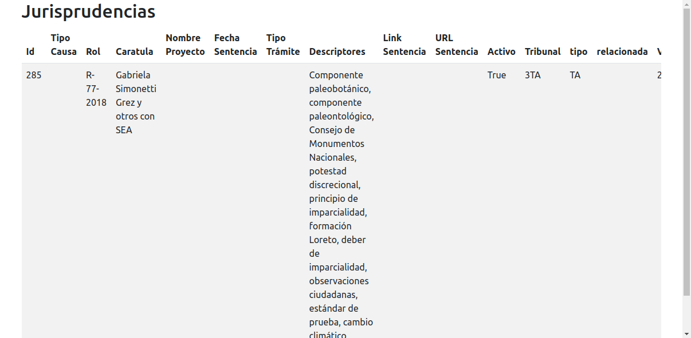
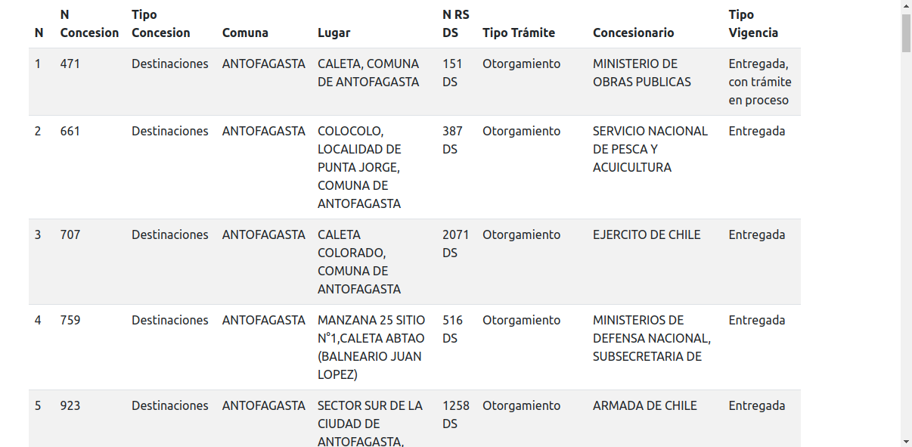

# TEST DEVELOPER
Para el sgte. test se utilizo el sistema operativo Ubuntu
### Instrucciones de Uso
1. Crear entorno virtual
`python -m venv env`
2. Ingresar al entorno
`source env/bin/activate`
3. Instalar dependencias
`pip install -r requirements.txt`
### Datos de conexión con la db
- name: test_developer
- user: luiggi
- password: admin
- host: localhost
- port: 5432
### Ejecutar migraciones 
`python manage.py migrate`
### Iniciar el server local
`python manage.py runserver`

## Tarea 1
#### Requerimientos
- Librería requerida a utilizar: Requests :heavy_check_mark:
- Obtenga la petición POST (list) con las jurisprudencias. :heavy_check_mark:
- Crear una función que obtenga la información presentada en la petición. :heavy_check_mark:
- Crear un modelo para la información presentada en la petición. :heavy_check_mark:
- Guardar en el modelo la información obtenida. :heavy_check_mark:
- Opcional. Generar vista en el administrador para visualizar la información obtenida. :heavy_check_mark:
- Opcional. Generar una vista con la información en Bootstrap 5 u otro similar. :heavy_check_mark:

### Lo que realice en base a lo entendido
1. Hice la petición post hacia la api que contiene las jurisprudencias en base al parámetro search
2. Creé un modelo para guardar las jurisprudencias y otro para los valores asociados a su jurisprudencia
3. Para guardar los datos en el modelo, desarrolle una view que recibe en su path parameter search el dato a buscar y el retorno de la request lo almacené en la db
4. Realice un admin custom para que se vean las tablas en el panel de django
5. Realice una plantilla que muestra una tabla con las jurisprudencias usando bootstrap 5

### Funcionamiento
1. Se hace una petición GET a la sgte. dirección
`http://127.0.0.1:8000/jurisprudencias/hola/`
hola puede ser cualquier dato de busqueda
2. Internamente se hace la petición POST a la api y luego se almacena la data obtenida en la db
3. Se muestra en el template la tabla con las jurisprudencias obtenidas de la busqueda

## Tarea 2
### Requerimientos
- Librería requerida a utilizar: Selenium WebDriver :heavy_check_mark:
- Crear un script para obtener la información presentada en una tabla luego de filtrar. :heavy_check_mark:
- Los filtros a utilizar son los siguientes:
    - Región: II :heavy_check_mark:
    - Gobernación Marítima: Antofagasta :heavy_check_mark:
    - Capitanía de Puerto: Antofagasta :heavy_check_mark:
- El script deberá recorrer todas las páginas y obtener la información de las tablas. :heavy_check_mark:
- El script deberá crear un archivo .json con la información obtenida. :heavy_check_mark:
- Generar modelo para guardar la información obtenida. :heavy_check_mark:
- Opcional. Generar vista en el administrador para visualizar la información obtenida. :heavy_check_mark:
- Opcional. Generar una vista con la información en Bootstrap 5 u otro similar. :heavy_check_mark:

### Lo que realice en base a lo entendido
1. Realice una función llamada `get_scraping_data()` que usa selenium para obtener los datos de una tabla a partir de los filtros indicados
2. Realice una función llamada `add_json_to_file()` que crea un archivo json con la data encontrada
3. Realice un modelo para guardar la data obtenida
4. Para almacenar la data realice una view que invoca a la funcion `get_scraping_data()` que obtiene los datos y luego a la función `add_json_to_file()` que crea el archivo json con la data y posteriormente guarde la data
5. Realice un admin custom para que se vea la tabla en el panel de django
6. Realice una plantilla que muestra una tabla con las  concesiones usando bootstrap 5

### Funcionamiento
1. Se realiza una petición GET a la sgte. ruta
`http://127.0.0.1:8000/scraping/`
Si es la primera vez que se realiza, puede dermorar unas milésimas ya que se descarga automáticamente el driver a usar
2. De forma automática se abre un ventana de chrome mostrado el sitio, se realiza el filtrado, se obtiene la tabla, se recorre cada tabla para obtener todos los datos y se retorna la data
3. Todavía en la ejecución de la vista se crea el archivo .json con la data
4. Se muestra una plantilla con una tabla que contiene los datos del scraping

